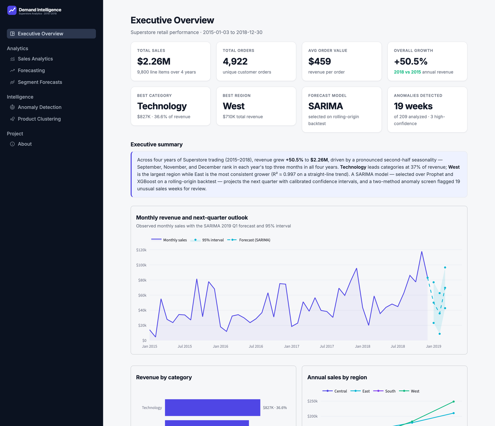
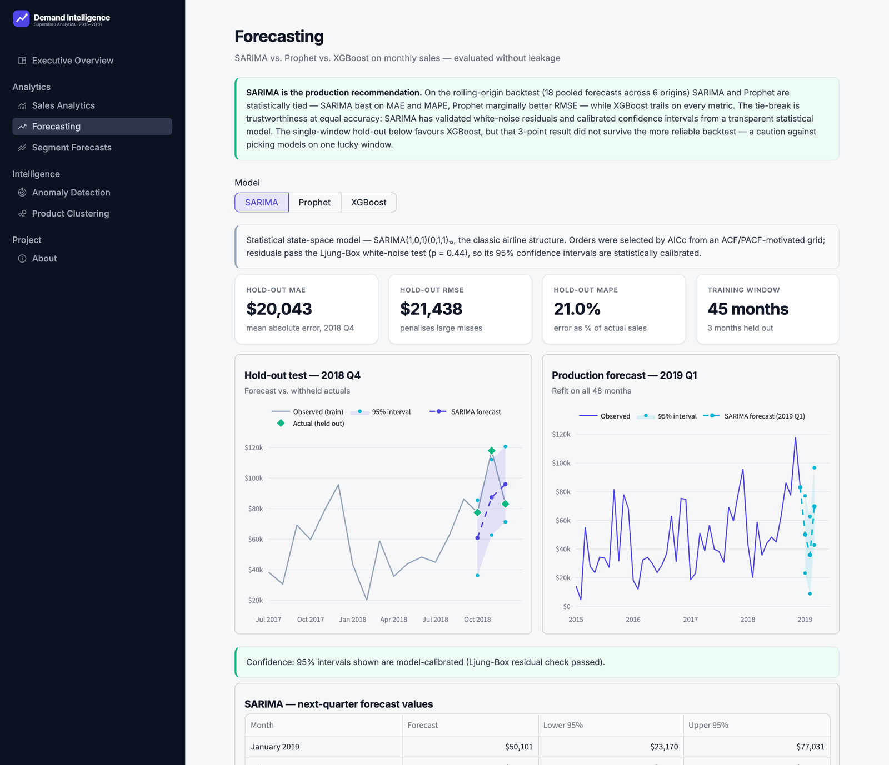
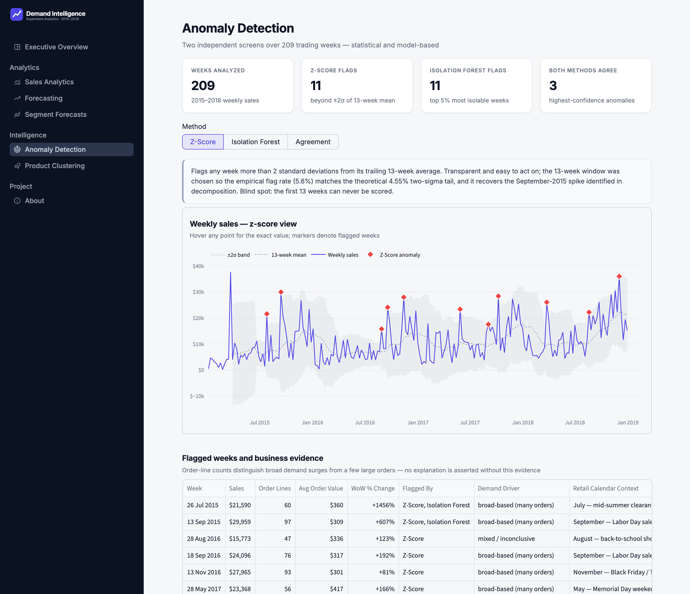
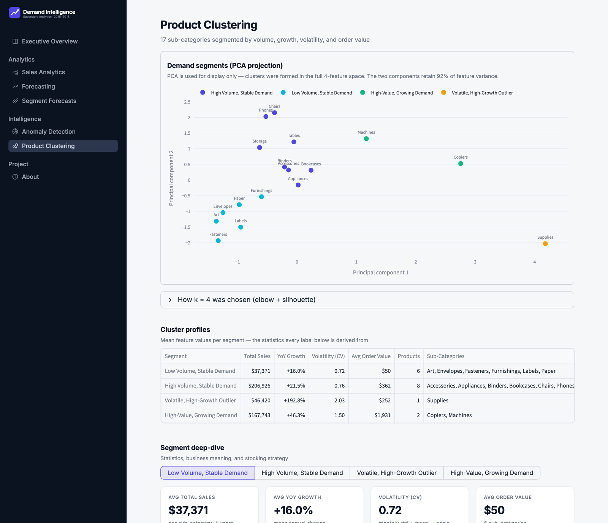

# Sales Forecasting & Demand Intelligence System

An end-to-end demand-intelligence project built on four years of Superstore retail data. It
takes raw order history through cleaning, time-series analysis, forecasting, anomaly
detection, and product segmentation, then delivers the results as an interactive Streamlit
dashboard and an executive business report.

The analysis lives in a single reproducible notebook; every model, chart, and statistic is
produced by tested modules under `src/`. The dashboard consumes precomputed artifacts and
never retrains a model on load.



## Overview

The project answers four questions a retail planner actually cares about: how much will we
sell next quarter, which weeks look unusual and why, which products behave differently
enough to warrant their own stocking policy, and how much confidence should be attached to
any of it. Each is addressed with a dedicated, evidence-backed analysis rather than a
single black-box model.

## Motivation

Inventory is a two-sided bet. Order too much and capital sits on a shelf; order too little
and the sale goes to a competitor. Both failures are expensive, and both come down to not
knowing how demand for each product is likely to move. Real demand is seasonal, varies by
region, occasionally spikes for reasons worth understanding, and behaves very differently
for a $15 box of paper than a $2,000 copier. This project builds the tooling to see those
patterns clearly and plan against them.

## Key Features

- **Reproducible analysis notebook** covering all eight project tasks, with every
  modelling decision justified from the data rather than assumed.
- **Three forecasting models compared without leakage** — SARIMA, Prophet, and XGBoost —
  evaluated on a chronological hold-out and a rolling-origin backtest before one is
  selected for production.
- **Category- and region-level forecasts** using the production model, with growth measured
  year-over-year to separate real trend from seasonal noise.
- **Dual-method anomaly detection** (rolling Z-score and Isolation Forest) cross-checked
  against each other, with every flagged week backed by order-line evidence.
- **K-Means demand segmentation** with cluster count chosen by the elbow method and
  silhouette score, and a stocking recommendation per segment.
- **Seven-page interactive dashboard** that reads precomputed artifacts — no model runs at
  page load.
- **Executive business report** (`reports/Executive_Business_Report.pdf`) written for a
  non-technical audience.

## Project Architecture

The project separates analysis, presentation, and reusable logic:

```
raw data ──▶ src/ pipelines ──▶ processed datasets ──▶ analysis.ipynb (notebook + charts)
                   │                                        │
                   └──▶ src/dashboard/artifacts.py ──▶ dashboard artifacts ──▶ Streamlit app
```

Reusable logic (loading, feature engineering, forecasting, anomaly detection, clustering)
lives in `src/`. The notebook orchestrates and explains it. `artifacts.py` runs the same
pipelines once and serializes the outputs, so the dashboard is pure presentation — it loads
cached artifacts and renders them, and never recomputes analytics. This keeps the app fast
and guarantees the dashboard and notebook always agree.

## Folder Structure

```
SalesForecasting_VishalJaiswal/
├── data/
│   ├── raw/                     # Source data (train.csv from Kaggle)
│   └── processed/                # Cleaned datasets + dashboard artifacts
├── src/
│   ├── data/                     # Loading, quality checks, aggregation
│   ├── features/                 # Time features and EDA analytics
│   ├── models/                   # SARIMA, Prophet, XGBoost, anomalies, K-Means
│   ├── visualization/            # Notebook chart builders and shared style
│   └── dashboard/                # Streamlit app: artifact builder, views, figures, theme
├── charts/                       # Chart images exported from the notebook
├── docs/screenshots/             # Dashboard screenshots
├── reports/Executive_Business_Report.pdf   # Executive business report
├── analysis.ipynb                # Main analysis notebook
├── app.py                        # Streamlit dashboard entry point
└── requirements.txt
```

## Technology Stack

| Area | Tools |
| --- | --- |
| Data engineering | pandas, NumPy |
| Statistics & forecasting | statsmodels (SARIMA, decomposition, ADF, Ljung-Box), Prophet, XGBoost, SciPy |
| Machine learning | scikit-learn (Isolation Forest, K-Means, PCA, metrics) |
| Visualization | Matplotlib, Seaborn (notebook); Plotly (dashboard) |
| Application | Streamlit |
| Notebook | Jupyter |

## Installation

```bash
git clone <repository-url>
cd SalesForecasting_VishalJaiswal

python -m venv .venv
source .venv/bin/activate          # Windows: .venv\Scripts\activate
pip install -r requirements.txt
```

The dataset is not bundled. Download the
[Superstore Sales dataset](https://www.kaggle.com/datasets/rohitsahoo/sales-forecasting)
from Kaggle and place `train.csv` in `data/raw/`.

## Running the Notebook

```bash
jupyter notebook analysis.ipynb
```

Running it top to bottom regenerates every processed dataset in `data/processed/` and every
figure in `charts/`. It executes cleanly start to finish with no manual steps.

## Running the Dashboard

The dashboard serves precomputed artifacts, so build those once (this runs the same `src/`
pipelines the notebook uses and takes under a minute):

```bash
python3 -m src.dashboard.artifacts
streamlit run app.py
```

Rebuild the artifacts whenever the underlying data or models change. The app itself never
retrains a model or reruns an analysis.

## Dashboard Screenshots

**Forecasting** — compare SARIMA, Prophet, and XGBoost with hold-out and backtest metrics:



**Anomaly Detection** — weekly sales screened by two independent methods, with evidence:



**Product Clustering** — sub-categories segmented into four demand groups:



## Results Summary

| Area | Finding |
| --- | --- |
| Scale | 9,800 line items, 4,922 orders, $2.26M revenue (2015–2018) |
| Growth | +50.5% annual revenue, 2018 vs 2015, concentrated in the final two years |
| Top category / region | Technology (36.6% of revenue); West ($710K), with East growing most consistently (R² ≈ 0.997) |
| Seasonality | September, November, and December rank top-three in all four years |
| Forecasting | SARIMA(1,0,1)(0,1,1)₁₂ selected; rolling-origin backtest MAPE 17.7% (SARIMA) vs 18.0% (Prophet) vs 20.4% (XGBoost) |
| Next quarter (2019 Q1) | $50.1K (Jan), $35.7K (Feb), $69.7K (Mar), with 95% intervals |
| Anomalies | 19 unusual weeks flagged of 209 (11 by Z-score, 11 by Isolation Forest, 3 by both) |
| Segments | 4 demand clusters, from an 8-product revenue backbone (73% of sales) to a single volatile outlier |

Every figure above is computed in `analysis.ipynb` and can be reproduced from the raw data.

## Future Improvements

- Extend the history as more data accumulates, to sharpen slow-moving trend estimates.
- Add external regressors (promotions, pricing, holidays) to the forecasting models —
  Prophet in particular supports this without a redesign.
- Automate monthly model retraining with drift monitoring on forecast accuracy.
- Host the dashboard with scheduled data refreshes rather than local execution.
- Move anomaly detection toward near-real-time monitoring.

## Dataset

Primary data is the Kaggle Superstore Sales dataset. A supplementary Video Game Sales
dataset was evaluated for the anomaly-detection task and deliberately excluded — it shares
no natural join key with the Superstore data, so merging it would have been forced rather
than analytical. That decision is documented at the start of Task 5 in the notebook.
